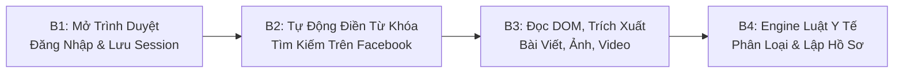

# HỆ THỐNG GIÁM SÁT NỘI DUNG Y TẾ & THẨM MỸ TRÊN MẠNG XÃ HỘI
> **Dành cho Giám sát viên / Cán bộ Thanh tra Y tế**  
> *Mạng xã hội • Thẩm mỹ • An toàn sức khỏe cộng đồng*

---

## 🏛️ 1. Căn Cứ Pháp Lý Áp Dụng
Hệ thống được thiết kế và vận hành trực tiếp dựa trên 4 văn bản quy phạm pháp luật cốt lõi:
1. **Luật Khám bệnh, chữa bệnh số 15/2023/QH15** (Điều 19, 83, 84): Quy định về phạm vi hành nghề phẫu thuật thẩm mỹ và điều kiện cơ sở khám chữa bệnh phải có Giấy phép hoạt động (GPHĐ) mới được thực hiện dịch vụ can thiệp xâm lấn cơ thể (nâng mũi, cắt mí, hút mỡ, tiêm filler, botox, căng da...).
2. **Luật Quảng cáo số 16/2012/QH13** (Điều 8, Điều 20, Điều 74): Cấm quảng cáo sai sự thật; cấm cam kết tuyệt đối (*"100% khỏi"*, *"vĩnh viễn không đau"*, *"trẻ hóa tức thì"*); bắt buộc có GPHĐ và nội dung quảng cáo phải được cơ quan y tế có thẩm quyền xác nhận trước khi phát hành.
3. **Nghị định 117/2020/NĐ-CP** (Điều 39, 40): Xử phạt vi phạm hành chính trong lĩnh vực y tế (phạt từ 40 - 50 triệu đồng và đình chỉ hoạt động 12 - 24 tháng đối với cơ sở KCB không phép hoặc vượt quá phạm vi chuyên môn).
4. **Nghị định 38/2021/NĐ-CP** (Điều 51, 56): Xử phạt vi phạm hành chính trong lĩnh vực quảng cáo dịch vụ KCB (phạt từ 30 - 40 triệu đồng đối với hành vi quảng cáo khi chưa có giấy phép hoạt động; xử phạt hành vi sử dụng hình ảnh "trước - sau" giả mạo).

---

## 🚀 2. Quy Trình Vận Hành 4 Bước (B1 - B4)



### **Bước 1 (B1): Mở trình duyệt đăng nhập và lưu đăng nhập cho lần sau**
- Hệ thống sử dụng **Playwright** tích hợp với hồ sơ lưu trữ an toàn (`userDataDir: c:\MXH\fb_session_data`).
- Khi cán bộ bấm nút **"Mở Trình Duyệt Đăng Nhập FB"**, hệ thống mở cửa sổ Google Chrome thực tế.
- Cán bộ thực hiện đăng nhập tài khoản Facebook, giải quyết 2FA hoặc captcha nếu có.
- Trình duyệt lưu toàn bộ Cookies, LocalStorage và Session Token vĩnh viễn. Các lần rà soát sau sẽ tự động kế thừa phiên đăng nhập mà không lo bị Facebook khóa tài khoản hay checkpoint.

### **Bước 2 (B2): Tự động điền từ khóa vào ô tìm kiếm trên FB**
- Crawler tự động điều hướng đến luồng tìm kiếm bài viết Facebook (`https://www.facebook.com/search/posts/?q=...`).
- Tự động điền các từ khóa chuyên ngành y tế/thẩm mỹ:
  - *Dịch vụ xâm lấn*: "nâng mũi cấu trúc", "cắt mí mini", "tiêm filler", "tiêm botox", "hút mỡ bụng", "nâng ngực nano".
  - *Dấu hiệu lừa dối/phóng đại*: "cam kết 100% không đau", "đẹp vĩnh viễn", "khỏi hẳn sau 1 liệu trình".
  - *Mạo danh chuyên môn*: "bác sĩ thẩm mỹ 20 năm", "viện thẩm mỹ quốc tế", "chuyển giao công nghệ hoa kỳ".

### **Bước 3 (B3): Đọc nội dung, hình ảnh, video của các trang, nhóm**
- Trích xuất tự động:
  - Tên Fanpage / Tài khoản / Nhóm và số lượng người theo dõi (Followers).
  - Nội dung toàn văn bài viết (Caption, Hashtags).
  - Định dạng ấn phẩm: **Video** (có thời lượng clip) hoặc **Hình ảnh** (Bộ ảnh Before / After) hoặc **Bài viết**.
  - Liên kết gốc (URL bài đăng) để lưu trữ bằng chứng.
  - Tương tác mạng xã hội: Lượt thích (Likes), Bình luận (Comments), Chia sẻ (Shares).

### **Bước 4 (B4): Lập danh sách các trang nghi ngờ vi phạm theo chính sách y tế**
- Bộ quy tắc **Rule Engine** và phân tích AI đối chiếu trực tiếp với các điều khoản pháp luật:
  - Tự động phân loại vi phạm: *Quảng cáo thẩm mỹ trái phép*, *Cam kết hiệu quả không đúng*, *Sử dụng hình ảnh trước/sau sai sự thật*, *Thông tin không được cấp phép*.
  - Đánh giá mức độ nghiêm trọng: **Cao (Đỏ)**, **Trung bình (Cam)**, **Thấp (Vàng)**.
  - Viện dẫn căn cứ điều khoản cụ thể của Luật KCB 15/2023, NĐ 117/2020 và NĐ 38/2021.
  - Đưa ra 4 đề xuất xử lý cho cán bộ: Gửi cảnh báo nền tảng, Yêu cầu gỡ bỏ, Xác minh thông tin cơ sở, Lập hồ sơ xử lý vi phạm.
  - Hỗ trợ **In Biên Bản Ghi Nhận Vi Phạm** (chuẩn biểu mẫu Thanh tra Sở Y tế) sẵn sàng ký đóng dấu.

---

## 💻 3. Hướng Dẫn Khởi Chạy Ứng Dụng

Ứng dụng hiện đang chạy trên máy tính của bạn tại địa chỉ:
👉 **`http://localhost:3001`**

### Khởi động thủ công:
```powershell
# Chạy cả backend API và frontend web app:
npm run dev

# Hoặc chạy backend trực tiếp:
node server/index.js
```

---

## 📁 4. Cấu Trúc Thư Mục
- `server/`
  - `analyzer.js`: Engine phân tích pháp lý đối chiếu Luật KCB 15/2023, Luật QC 16/2012, NĐ 117/2020, NĐ 38/2021.
  - `crawler.js`: Playwright browser automation quản lý phiên đăng nhập và quét bài viết tự động.
  - `db.js`: Cơ sở dữ liệu JSON lưu trữ 156+ vi phạm và lịch sử rà soát.
  - `export.js`: Trình xuất Biên bản ghi nhận vi phạm hành chính chuẩn Thanh tra Y tế (HTML / Print / PDF).
  - `index.js`: REST API Server & Server-Sent Events (SSE) thời gian thực.
- `client/`
  - `src/components/Header.jsx`: Thanh điều hướng trên cùng, tìm kiếm toàn hệ thống, thông báo.
  - `src/components/Sidebar.jsx`: Menu chức năng, danh sách vi phạm, banner bảo vệ sức khỏe cộng đồng.
  - `src/components/StatCards.jsx`: 4 thẻ thống kê số liệu tổng quan.
  - `src/components/ViolationChart.jsx`: Biểu đồ tròn (Donut chart) phân bổ tỉ lệ vi phạm.
  - `src/components/FilterBar.jsx`: Bộ lọc đa tiêu chí (Nền tảng, Loại nội dung, Loại vi phạm, Thời gian).
  - `src/components/ViolationsTable.jsx`: Bảng danh sách 156 vi phạm với badge trạng thái và phân trang.
  - `src/components/ViolationDetailModal.jsx`: Ngăn xem chi tiết vi phạm bên phải, video player, phân tích AI và nút in biên bản.
  - `src/components/CrawlerModal.jsx`: Trung tâm điều khiển tự động rà soát mạng xã hội theo quy trình B1 - B4.
  - `src/components/KeywordsView.jsx`: Quản lý bộ từ khóa y tế.
  - `src/components/AccountsView.jsx`: Quản lý danh sách các Fanpage/Cơ sở thẩm mỹ vi phạm trọng điểm.
- `fb_session_data/`: Thư mục lưu trữ phiên đăng nhập Facebook an toàn của cán bộ.
